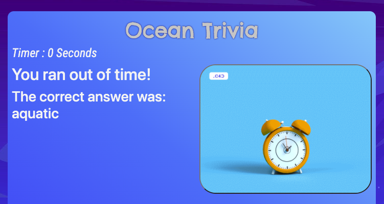

# Ocean Trivia

## Overview
- Test how well you know the ocean.  Includes questions covering the environment, critters, and physics of the ecosystem.

## Directions
1. Access the [Ocean Trivia Game](https://hgowton.github.io/OceanTrivia/).

1. Click Start to enter 

1. You have 30 seconds to read and answer each multiple choice question. 
   1. The **wrong answer screen** will appear if you answered the question incorrectly or if you do not answer within the 30 second time limit. 
   

   1. Answer the question correctly to reveal the **correct answer screen**. 
   

   1. Each screen will appear for 3 seconds and contain an image along with more information about the question.

1. A final results screen will appear at the end of the game to reveal your final performance stats.  Click Reattempt to take another go at the questions.  
